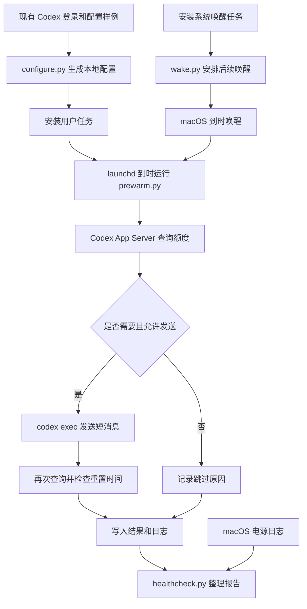

# 项目架构

项目分成两个定时任务和一个按需运行的检查脚本。系统任务提前安排唤醒；用户任务在指定时间查询额度，必要时发送消息；检查脚本整理已有结果。它们运行完就退出。

## 各模块做什么

| 模块 | 具体工作 |
| --- | --- |
| [`configure.py`](configure.py) | 读取本机现有 Codex 登录，计算账号哈希值，发现 CLI 和 Node 路径，生成本地配置。 |
| [`install-user.py`](install-user.py) | 把用户脚本及配置复制到 Library，生成并加载 LaunchAgent（用户定时任务）。 |
| [`install-wakes.py`](install-wakes.py)、[`install-system.sh`](install-system.sh) | 暂存安装文件，请求管理员授权，安装系统唤醒脚本并加载 LaunchDaemon（系统定时任务）。 |
| [`local.codex-prewarm.wakes.plist`](local.codex-prewarm.wakes.plist)、[`wake.py`](wake.py) | 安装后立即安排唤醒，并在每天的维护时间继续补齐后续计划。 |
| [`prewarm.py`](prewarm.py) | 检查执行时间和账号，查询额度，决定是否发送，并在发送后检查新的重置时间。 |
| [`healthcheck.py`](healthcheck.py) | 读取任务状态、脚本日志和电源日志，生成本地检查报告。它不发送模型请求。 |
| [`uninstall.py`](uninstall.py)、[`uninstall-system.sh`](uninstall-system.sh) | 先撤销系统任务及本项目的唤醒事件，再移除用户任务，保留代码和日志。 |
| [`tests/`](tests)、[GitHub Actions](.github/workflows/checks.yml) | 检查额度判断和配置处理；CI 还检查安装、卸载 shell 脚本的语法。 |

## 文件和信息怎么流转

配置阶段，`configure.py` 读取已有登录文件和配置样例，把账号哈希值及本机路径写入项目目录的 `config.json`。安装器将运行所需文件复制到 Library；因此后续修改项目目录中的代码或配置，需要重新安装才会生效。

系统唤醒任务不读取 Codex 登录。用户任务读取登录文件确认账号，再通过官方 CLI 查询和发送请求。请求结束后，结果写入 Library 中的状态文件和日志。检查脚本从这些文件及 macOS 电源日志生成 `healthcheck.json`。

## 一次定时执行的流程

1. 系统按此前登记的计划唤醒 Mac，用户定时任务到时运行。`caffeinate` 在用户脚本运行期间防止闲置休眠。
2. `prewarm.py` 获取文件锁，并检查是否仍处于允许执行的时间范围。
3. 脚本检查登录账号是否与配置一致，再查询五小时额度和周额度。
4. 如果本轮计时还在进行、这个时间点已尝试过发送，或无法确认可以发送，脚本记录结果后退出。
5. 发送前先记下这次尝试，再运行 `codex exec`。这样即使发送时发生超时，也不会因重复启动而补发。
6. CLI 完成请求后，脚本再次查询服务器。确认新的重置时间后才报告计时开始；无法确认时则保留请求已完成的记录。

具体判断条件、等待时间和退出码见[实现细节](docs/implementation.md)。

## 为什么采用这些技术

| 技术 | 选择原因 |
| --- | --- |
| Python 标准库 | 项目处理子进程、JSON、文件锁和日志，不需要额外安装 Python 包。 |
| launchd | 使用 macOS 自带的定时任务；用户登录后可按计划运行，系统任务可独立维护唤醒安排。 |
| pmset | launchd 不能自己唤醒 Mac，pmset 可以提前向系统登记唤醒时间。使用单次事件才能安排每天三个时间点，并保留其他程序的计划。 |
| Codex App Server，stdio（标准输入输出） | 通过官方 CLI 的接口查询账号和额度，不另外实现服务端认证。脚本用 selectors 等待返回消息，不使用额外工作线程。 |
| codex exec | 使用现有 ChatGPT 登录完成一次短请求；不需要 API Key，也不需要让桌面聊天自动发送消息。 |
| JSON 文件、文件锁和日志 | 数据量很小，文件足够保存结果；文件锁阻止两个脚本同时运行，发送前保存记录防止重复尝试。 |

## 权限和运行范围

系统脚本由 root 拥有，仅维护带本项目标记的唤醒事件。用户脚本使用当前用户的 Codex 登录，并以只读沙箱运行模型请求。配置不复制登录令牌，运行日志不保存原始 RPC 消息或模型输出。

账号配置和运行报告只保存在本机，由 Git 忽略。休眠条件、安装位置及保留哪些文件见[部署与维护](docs/deployment.md)；目前已确认和仍待验证的情况见[测试说明](docs/testing.md)。
